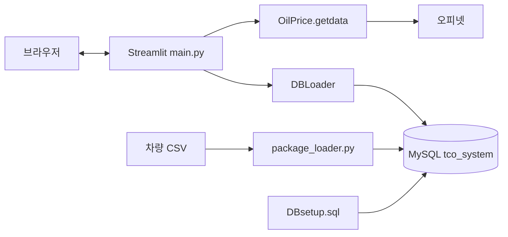

# 시스템 구조

화면 렌더링·세션·비용 계산은 `main.py`의 Streamlit 프로세스에서 실행됩니다. MySQL과 오피넷이 외부 의존성입니다. 별도 웹 프런트엔드 빌드나 REST 서버는 없습니다.

| 구성 | 책임 | 경계 |
| --- | --- | --- |
| `main.py` | 입력·선택·단가·계산·출력 | UI와 계산이 한 파일에 결합 |
| `DBLoader.py` | 연결 생성과 SQL 실행 | 호출마다 연결; 오류는 빈 목록 반환 |
| `package_loader.py` | 스키마 정의와 CSV 적재 | 재실행하면 차량 테이블 교체 |
| `OilPrice.py` | 유종별 XML 가격 추출 | 실패 시 -1.0 |
| `CarOil.py`, `CarPrice.py` | 별도 수집 코드 | 메인 DB 조회 경로에 포함되지 않음 |

계산 결과를 DB에 저장하지 않습니다. 부품 조회에는 데이터 캐시가 적용되며 인증·사용자별 이력·작업 큐·자동 갱신 구성은 없습니다.

[데이터 흐름](data-flow.md) · [문서 목록](../README.md)
