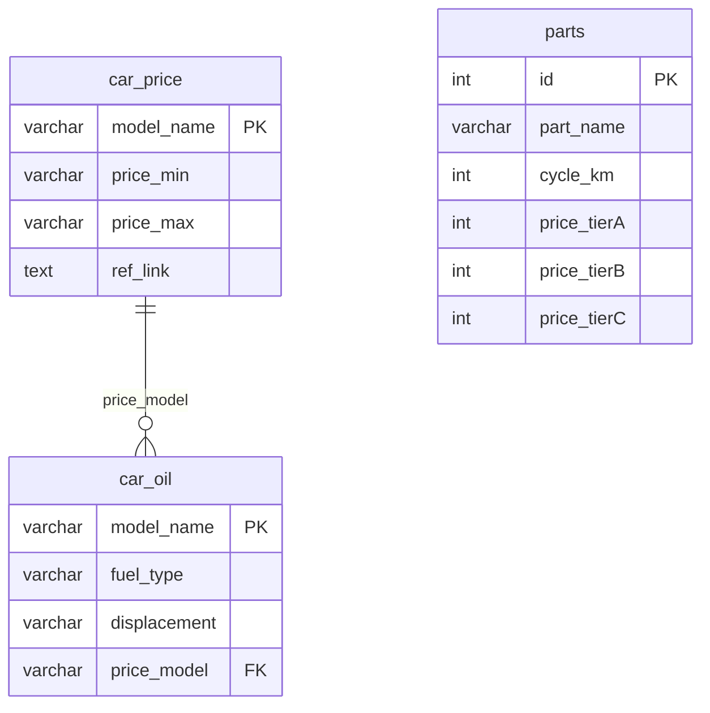

# 스키마와 ERD

DB명은 `tco_system`입니다. 부품 스키마는 `database/init/DBsetup.sql`, 차량 스키마는 `package_loader.py`에서 정의합니다.

`car_oil.price_model`은 NULL 허용입니다. 부품은 차량에 외래키로 연결되지 않으며 계산 시 배기량으로 단가 열을 선택합니다.

## 연비 튜플의 열 순서

| 인덱스 | 열 | 타입·의미 |
| --- | --- | --- |
| 0 | `model_name` | VARCHAR(50), PK |
| 1 | `comp_name` | VARCHAR(20), NOT NULL, 제조사 |
| 2 | `fuel_type` | VARCHAR(20), NOT NULL, 연료 |
| 3–5 | `fuel_eff_mix`, `fuel_eff_cty`, `fuel_eff_hw` | VARCHAR(20), NOT NULL, 복합·도심·고속 효율 |
| 6 | `run_per_charge` | VARCHAR(20), 충전 주행거리 |
| 7 | `estm_fuel_price` | VARCHAR(20), NOT NULL, 원본 예상 연료비; 합산에는 미사용 |
| 8 | `car_class` | VARCHAR(10), NOT NULL, 연비 등급 |
| 9 | `displacement` | VARCHAR(10), 배기량 cc |
| 10 | `release_year` | VARCHAR(10), NOT NULL, 연식 |
| 11 | `price_model` | VARCHAR(50), FK, 가격 모델 |

수치를 문자열로 저장하므로 계산 시 변환이 필요합니다. 전기 효율은 km/kWh, 나머지는 km/L로 표시합니다.

## 가격과 부품

`car_price`는 `model_name VARCHAR(50)` 기본키, `price_min`·`price_max VARCHAR(10)`, `ref_link TEXT`입니다. 가격은 만원 단위로 표시하고 `ref_link`는 이미지 주소로 사용합니다.

`parts.id`는 자동 증가 INT 기본키, `part_name`은 VARCHAR(100) NOT NULL, `cycle_km`은 NULL 가능한 INT, 세 단가는 INT NOT NULL입니다. 가격은 원, 주기는 km입니다. 엔진오일·점화플러그·냉각수·타이밍벨트/체인·브레이크 패드·브레이크 디스크·미션오일·타이어·배터리·쇼크업소버의 10개 기준 행이 있습니다. 정확한 금액·주기는 SQL이 기준입니다.

현재 누적거리와 교체 이력을 저장하는 열은 없습니다. 예상 교체 시기는 실제 차량의 잔여 부품 수명이 아닙니다.

[데이터 흐름](../02-architecture/data-flow.md) · [문서 목록](../README.md)
